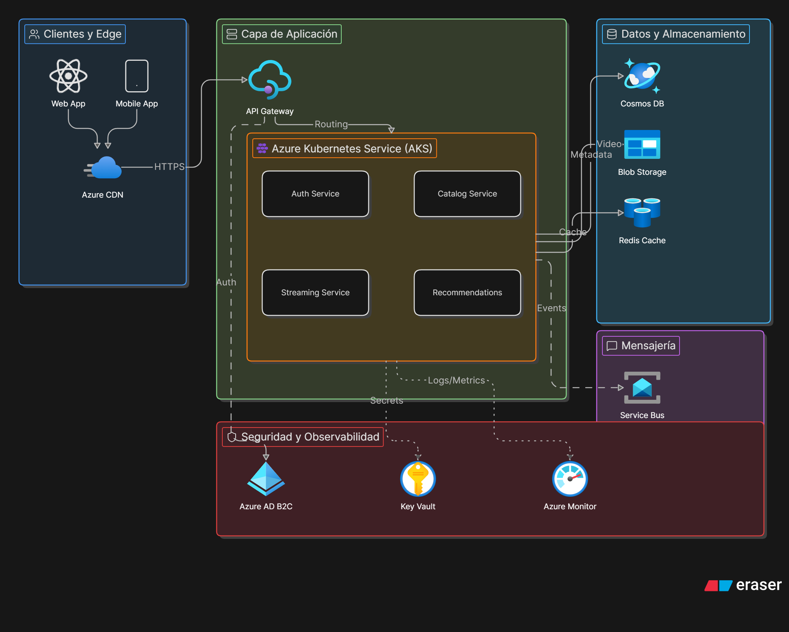
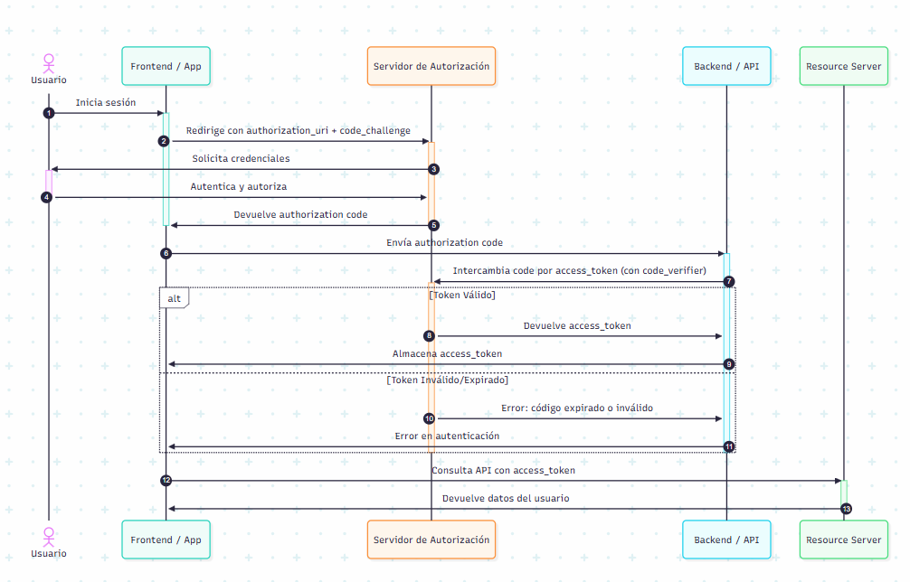

# Clase 03 - IA para programadores

## Utilizando Ollama

<https://ollama.com/>

<https://ollama.com/download>

## Modelos de IA de Open Source de OpenAI

<https://huggingface.co/collections/openai/gpt-oss>

## Interfaz gráfica para poder usar los modelos de Ollama

<https://openwebui.com/>
<https://lmstudio.ai/>

<https://github.com/open-webui/open-webui>


> NOTA: Para utilizar openui se puede utilizar con Docker

# Descargando Docker (AMD64)

<https://www.docker.com/>

## Abrimos una terminal y ejecutamos el comando 

```sh
docker run -d -p 3000:8080 --add-host=host.docker.internal:host-gateway -v open-webui:/app/backend/data --name open-webui --restart always ghcr.io/open-webui/open-webui:main
```

## Probar y conocer IAs

<https://arena.ai/>

## Open Router (Api Key que me da acceso a varios modelos)

<https://openrouter.ai/>

## IA para crear música

<https://suno.com/>


# Diagram GPT
Herramienta para diagramar y generar diagramas de arquitectura, entidad relación, secuencia, procesos y flujo.

```prompt
Estoy pensando en hacer un diagrama de arquitectura en la IA Diagram y necesito ayuda con respecto a la formulación del prompt. ¿Qué cosas tener en cuenta y como hacer un prompt para que cubra mi necesidad. Investiga la mejor forma (mejores practicas) para poder tener el prompt. TGe paso una idea de lo que necesito.
"Genera un diagrama de arquitectura de una aplicación tipo neflix que voy hacer un deploy en azure"
```

<https://chatgpt.com/share/6a16fa43-a984-83e9-ac03-841e9215d14b>



## Diagramas Mermaid

<https://mermaid.js.org/>

```prompt
Necesito ayuda para generar un diagrama de secuencia con la IA mermaidlive me gustaría me des la merjores practicas para generar un prompot más optimo. Te dejo a continuación el prompt que tengo.
```

<https://gemini.google.com/share/236ea73db5a1>

<https://claude.ai/share/9d9d82f5-d341-42c7-8273-a60d83c8ced4>

<https://mermaid.ai/app/projects/3a7f5439-38fe-4b43-83ac-6ab62d40c8fc/diagrams/4858b695-fc2c-4654-9811-149b12a784fc/version/v0.1/edit>

